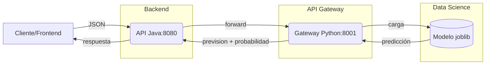
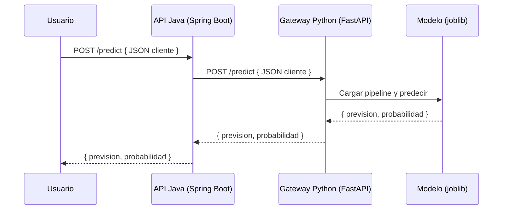

# ChurnInsight

MVP para predicción de cancelación (churn) con modelo de DS y APIs.

## Estructura

- `data-science/`: notebooks, código Python y modelos entrenados.
- `api-gateway/`: microservicio Python (FastAPI) que carga el modelo serializado.
- `api-java/`: API REST Java (Spring Boot) que reexpone los endpoints y valida entradas.
- `shared/`: dataset compartido.

## Tabla de contenidos
- [Pasos de ejecución](#pasos-de-ejecución)
- [Endpoints](#endpoints)
- [Segmentación por modelo](#segmentación-por-modelo)
- [Diagrama](#diagrama-mermaid)
- [Diagrama de Secuencia](#diagrama-de-secuencia-mermaid)
- [Pruebas](#pruebas-automatizadas)
- [Docker Compose](#orquestación-con-docker-compose)
- [Predicción masiva (CSV)](#predicción-masiva-csv)
- [Dashboard web](#dashboard-web)
- [Auto‑reentrenamiento por drift](#auto‑reentrenamiento-por-drift)
- [A/B testing de retención](#ab-testing-de-retención)
- [Calibración y métricas en dashboard](#calibración-y-métricas-en-dashboard)
- [Configuración (variables de entorno)](#configuración-variables-de-entorno)
- [Troubleshooting](#troubleshooting)
- [Seguridad y privacidad](#seguridad-y-privacidad)
- [Rendimiento y escalabilidad](#rendimiento-y-escalabilidad)
- [FAQ](#faq)

### Guías adicionales
- [Guía no técnica (uso del modelo)](README_no_tecnico.md)
- [Guía de ejecución en distintos editores](shared/docs/ejecucion_editors.md)

## Contrato de integración (JSON)

- Entrada:
```
{
  "tiempo_contrato_meses": 12,
  "retrasos_pago": 2,
  "uso_mensual": 14.5,
  "plan": "Premium",
  "nps": 7,
  "quejas": 1,
  "canal_contacto": "app",
  "interacciones_soporte": 2,
  "tipo_pago": "debito_automatico",
  "region": "norte",
  "tipo_cliente": "nuevo"
}
```

### Valores esperados

| Variable       | Valores permitidos                 |
|----------------|------------------------------------|
| `region`       | `norte`, `sur`, `este`, `oeste`    |
| `tipo_cliente` | `nuevo`, `antiguo`, `corporativo`  |
- Salida:
```
{
  "prevision": "Va a cancelar",
  "probabilidad": 0.81
}
```

## Requisitos

- Python 3.13+
- Java 21+
- Maven (instalación rápida sin administrador):
  - Descarga automática y ajuste de PATH en la sesión:
  ```
  $mvnVersion = '3.9.12'
  $mvnUrl = "https://archive.apache.org/dist/maven/maven-3/$mvnVersion/binaries/apache-maven-$mvnVersion-bin.zip"
  $zipPath = "$env:TEMP\apache-maven-$mvnVersion-bin.zip"
  $installDir = 'C:\\Tools'
  Invoke-WebRequest -Uri $mvnUrl -OutFile $zipPath
  New-Item -ItemType Directory -Force -Path $installDir | Out-Null
  Expand-Archive -Path $zipPath -DestinationPath $installDir -Force
  $env:MAVEN_HOME = "C:\\Tools\\apache-maven-$mvnVersion"
  $env:Path = "$($env:MAVEN_HOME)\\bin;$env:Path"
  mvn -v
  ```

## Pasos de ejecución

1. Preparar entorno Python e instalar dependencias:

```
python -m venv .venv
.\.venv\Scripts\python -m pip install -U pip
.\.venv\Scripts\pip install -r data-science/requirements.txt
.\.venv\Scripts\pip install -r api-gateway/requirements.txt
```

2. Entrenar y serializar el modelo:

```
.\.venv\Scripts\python data-science/src/train_model.py
```

3. Iniciar el microservicio Python (gateway):

```
.\.venv\Scripts\python -m uvicorn api-gateway.app:app --host 127.0.0.1 --port 8001
```

4. Iniciar API Java (requiere gateway corriendo):

```
cd api-java
mvn spring-boot:run
```

5. Probar fin-a-fin (desde la API Java):

```
curl -X POST http://127.0.0.1:8080/predict \
  -H "Content-Type: application/json" \
  -d '{"tiempo_contrato_meses":12,"retrasos_pago":2,"uso_mensual":14.5,"plan":"Premium"}'
```

### Ajuste de umbral (costo/beneficio)
- Umbral por defecto: `0.5` (puede cambiarse por entorno o por petición).
- Por entorno (gateway):
```
CHURN_THRESHOLD=0.6 uvicorn api-gateway.app:app
```
- Por petición (API Java o gateway):
```
curl -X POST "http://127.0.0.1:8080/predict?umbral=0.6" \
  -H "Content-Type: application/json" \
  -d '{"tiempo_contrato_meses":12,"retrasos_pago":2,"uso_mensual":14.5,"plan":"Premium","nps":7,"quejas":1,"canal_contacto":"app","interacciones_soporte":2,"tipo_pago":"debito_automatico"}'
```

## Endpoints

- Gateway (Python) en `http://127.0.0.1:8001`:
  - `POST /predict`
  - `POST /predict_bulk` (CSV masivo; admite `umbral`, `explain_top`, `strict_telco`)
  - `POST /normalize_csv` (normaliza columnas de un CSV; admite `strict_telco`)
  - `GET /stats`, `GET /segment_metrics`, `GET /calibration_report`
  - `POST /calibrate_threshold`, `POST /retrain`
  - `GET /drift_status` (score y eventos recientes)
  - `GET /dashboard`, `GET /dashboard_history`, `POST /clear_history`
  - A/B testing: `POST /ab/create`, `POST /ab/assign`, `POST /ab/outcomes`, `GET /ab/report`, `GET /ab/list`
  - `GET /favicon.ico` (favicon embebido para evitar 404)
- API Java en `http://127.0.0.1:8080`:
  - `POST /predict`, `GET /stats`, `POST /calibrate`, `POST /retrain`, `POST /predict-bulk`

### Segmentación por modelo
- Activar segmentación por entorno: `SEGMENTATION_KEY=plan|region|tipo_cliente`.
- Entrenamiento guarda modelos por segmento en `data-science/models` con nombre `model__seg__<key>__<valor>.joblib` y un `segments.json` con `key` y lista de segmentos.
- El gateway carga los modelos segmentados al iniciar y usa el específico si existe; en caso contrario usa el global. La respuesta puede incluir `segmento: { key, value }` cuando aplique.
- Ejemplo de ejecución:
```
SEGMENTATION_KEY=region .\.venv\Scripts\python data-science/src/train_model.py
SEGMENTATION_KEY=region .\.venv\Scripts\python -m uvicorn api-gateway.app:app --host 127.0.0.1 --port 8001
```
 - Nota: para usar modelos segmentados es necesario entrenar y arrancar el gateway con la misma clave de segmentación, por ejemplo `SEGMENTATION_KEY=region`.

## Diagrama (Mermaid)



- Diagrama extendido con drift y A/B: ver `shared/docs/diagrama.mmd`.

## Diagrama de Secuencia (Mermaid)



## Exportar como imagen (PNG)

- Fuente Mermaid disponible en `shared/docs/diagrama.mmd`.
- Opciones de exportación:
  - Con Node + mermaid-cli:
    ```
    npm i -g @mermaid-js/mermaid-cli
    mmdc -i shared/docs/diagrama.mmd -o shared/docs/diagrama.png
    ```
  - Sin instalar Node, usando Docker:
    ```
    docker run --rm -v %cd%:/data minlag/mermaid-cli mmdc -i /data/shared/docs/diagrama.mmd -o /data/shared/docs/diagrama.png
    ```
  - Editores online: mermaid.live o draw.io (pegar el bloque de código Mermaid).

## Pruebas automatizadas

- Gateway Python (pytest):
```
.\.venv\Scripts\pip install -r api-gateway/requirements.txt
.\.venv\Scripts\python -m pytest -q api-gateway/tests
```

- API Java (JUnit con MockMvc):
```
cd api-java
$env:MAVEN_HOME = 'C:\\Tools\\apache-maven-3.9.12'; $env:Path = "$env:MAVEN_HOME\\bin;$env:Path"; mvn -q test
```

## Orquestación con Docker Compose

1. Construir y levantar servicios:
```
docker compose up --build
```
2. Probar fin-a-fin:
```
curl -X POST http://127.0.0.1:8080/predict \
  -H "Content-Type: application/json" \
  -d '{"tiempo_contrato_meses":12,"retrasos_pago":2,"uso_mensual":14.5,"plan":"Premium"}'
```

### API Java: ejemplos de calibración y reentrenamiento
- Calibrar umbral reenviando al gateway:
```
curl -X POST "http://127.0.0.1:8080/calibrate?modo=f1&beneficio=40&costo=10"
```
- Reentrenar el modelo y recargar en gateway:
```
curl -X POST "http://127.0.0.1:8080/retrain"
```
- Reentrenar con dataset específico:
```
curl -X POST "http://127.0.0.1:8080/retrain?data_path=C:\\Users\\Kabie\\Desktop\\Data\\proyecto-data\\shared\\data\\dataset.csv"
```

### Ejemplos de payloads segmentados (curl)
- Por región:
```
curl -X POST http://127.0.0.1:8080/predict \
  -H "Content-Type: application/json" \
  -d '{
    "tiempo_contrato_meses": 10,
    "retrasos_pago": 1,
    "uso_mensual": 12.0,
    "plan": "Basico",
    "nps": 5,
    "quejas": 1,
    "canal_contacto": "web",
    "interacciones_soporte": 1,
    "tipo_pago": "tarjeta",
    "region": "norte",
    "tipo_cliente": "nuevo"
  }'
```
- Por tipo de cliente:
```
curl -X POST http://127.0.0.1:8080/predict \
  -H "Content-Type: application/json" \
  -d '{
    "tiempo_contrato_meses": 8,
    "retrasos_pago": 0,
    "uso_mensual": 18.5,
    "plan": "Estandar",
    "nps": 8,
    "quejas": 0,
    "canal_contacto": "app",
    "interacciones_soporte": 1,
    "tipo_pago": "debito_automatico",
    "region": "este",
    "tipo_cliente": "corporativo"
  }'
```

### Predicción masiva (CSV)
- Gateway:
```
curl -X POST "http://127.0.0.1:8001/predict_bulk?umbral=0.6&explain_top=3&strict_telco=0" \
  -H "Content-Type: multipart/form-data" \
  -F "file=@C:\\Users\\Kabie\\Desktop\\Data\\proyecto-data\\shared\\data\\dataset.csv"
```
- API Java:
```
curl -X POST http://127.0.0.1:8080/predict-bulk \
  -H "Content-Type: multipart/form-data" \
  -F "file=@C:\\Users\\Kabie\\Desktop\\Data\\proyecto-data\\shared\\data\\dataset.csv"
```

### CSV flexible y sinónimos
- El gateway permite CSVs no‑Telco y normaliza encabezados con `POST /normalize_csv`.
- Reglas:
  - Requiere al menos 3 de 4 campos núcleo: `plan`, `tiempo_contrato_meses`, `retrasos_pago`, `uso_mensual`.
  - Si faltan columnas no núcleo, aplica valores por defecto razonables.
  - Ejemplos de sinónimos admitidos:
    - `Subscription Length (Months)` → `tiempo_contrato_meses`
    - `Daily Watch Time (Hours)` → `uso_mensual`
    - Variantes de pago (`card`, `credit_card`) → `tipo_pago=tarjeta`
- Ejemplo:
```
curl -X POST "http://127.0.0.1:8001/normalize_csv?strict_telco=0" \
  -H "Content-Type: multipart/form-data" \
  -F "file=@C:\\Users\\Kabie\\Desktop\\Data\\proyecto-data\\shared\\data\\dataset.csv"
```

## Dashboard web

- Abrir `http://127.0.0.1:8001/dashboard` una vez iniciado el gateway.
- Controles principales:
  - `Seleccionar CSV`: archivo con clientes; el sistema normaliza sinónimos y valores.
  - `Normalizar y descargar`: usa `POST /normalize_csv` para corregir encabezados y tipos.
  - `Subir CSV y predecir`: envía a `POST /predict_bulk` y muestra resultados.
  - `Umbral opcional`: ajusta el umbral por petición.
  - `Explicación mínima (top-1)`: reduce factores explicativos por fila.
  - `Solo Telco`: modo estricto; solo acepta columnas del `telecom_cleaned.csv` original.
  - Filtros por `plan` y `región`, paginación, y envío de alertas al CRM si `p≥umbral`.
  - Secciones: tendencia de riesgo promedio, calibración por bins y por segmento, y módulo A/B.

### ¿Qué hace "Solo Telco"?

- Al activarlo, el gateway exige el esquema del dataset Telco (`telecom_cleaned.csv`) y rechaza CSVs con columnas distintas.
- Útil para comparar contra el baseline original o validar integridad del flujo Telco.
- Por defecto está desactivado; se activa marcando el checkbox del dashboard o enviando `strict_telco=1` en los endpoints de CSV.

## Auto‑reentrenamiento por drift

- El gateway calcula drift por lote: PSI para numéricos y TVD para categóricos.
- Si `AUTO_RETRAIN=1` y `DRIFT_THRESHOLD` se supera, lanza un reentrenamiento en background y recarga modelos.
- Consultar estado reciente: `GET /drift_status`.
- El entrenamiento guarda el baseline en `data-science/models/baseline.json` que el gateway usa para comparar distribuciones.
- Ejemplos:
  - Iniciar gateway con auto‑retrain: ``AUTO_RETRAIN=1 DRIFT_THRESHOLD=0.25 uvicorn api-gateway.app:app``
  - Ver eventos: ``curl http://127.0.0.1:8001/drift_status``

## A/B testing de retención

- Flujo básico:
  - Crear experimento: ``curl -X POST "http://127.0.0.1:8001/ab/create?nombre=Campaña%20SMS&ratio_tratamiento=0.5"``
  - Asignar usuarios (CSV con columna `id`): ``curl -X POST "http://127.0.0.1:8001/ab/assign?exp_id=123" -F "file=@usuarios.csv"``
  - Subir outcomes (CSV con `id` y `churn`/`retained`/`revenue`): ``curl -X POST "http://127.0.0.1:8001/ab/outcomes?exp_id=123" -F "file=@outcomes.csv"``
  - Generar reporte: ``curl "http://127.0.0.1:8001/ab/report?exp_id=123"``
  - Listar experimentos: ``curl "http://127.0.0.1:8001/ab/list"``
 - Persistencia: los experimentos se guardan en `data-science/models/ab_experiments.json`.
 - Reporte incluye uplift, `z-score` y `p-value` para significancia estadística.

### Calibración y métricas en dashboard

- Reporte de calibración: `GET /calibration_report?bins=10&segment=<opcional>`.
- El dashboard permite seleccionar `bins` y `segmento` para ver la curva de fiabilidad y `ECE`.

## Configuración (variables de entorno)

- `CHURN_THRESHOLD`: umbral de decisión base (ej. `0.5`).
- `AUTO_RETRAIN`: `1` para activar reentrenamiento automático por drift.
- `DRIFT_THRESHOLD`: umbral de drift (ej. `0.25`).
- `TRAIN_DATA_PATH`/`DATASET_PATH`: ruta del CSV para entrenamiento.
- `CALIBRATION_METHOD`: `isotonic` o `sigmoid` para calibración de probabilidades.
- `SEGMENTATION_KEY`: `plan` | `region` | `tipo_cliente` para entrenar modelos por segmento.
- `RETENTION_BENEFIT` y `RETENTION_COST`: parámetros para calibrar umbral por `expected_gain`.
- `VALIDATION_PATH`: CSV para calcular reporte de calibración en `GET /calibration_report`.

## Troubleshooting

- `net::ERR_CONNECTION_REFUSED` al abrir el dashboard:
  - Verifica que el gateway esté corriendo y espera “Application startup complete”.
  - Evita cerrar el proceso al refrescar el navegador; reinicia si cambiaste código.
- `GET /favicon.ico 404` en logs:
  - Resuelto; el gateway devuelve un favicon mínimo.
- CSV rechazado por columnas:
  - Usa `POST /normalize_csv` para adaptar encabezados y tipos o desactiva “Solo Telco”.
- Puertos en uso (`8001/8080`):
  - Cambia `--port` al arrancar gateway o detén procesos ocupando esos puertos.

## Seguridad y privacidad

- No subir información sensible innecesaria en CSV/JSON.
- No se registran secretos ni tokens en logs.
- Para integraciones externas (CRM webhook), validar la URL y usar HTTPS.

## Rendimiento y escalabilidad

- Predicción masiva procesa CSVs grandes con paginación en el dashboard.
- Segmentación permite optimizar por población específica.
- Calibración mejora fiabilidad de probabilidades para decisiones.

## FAQ

- ¿Qué hace “Solo Telco”?
  - Modo estricto que acepta sólo el esquema del dataset Telco. Útil para validar contra el baseline original.
- ¿Cómo ajusto el umbral sin reiniciar?
  - Enviar `umbral` en la petición o usar `POST /calibrate_threshold`.
- ¿Cómo entreno con mi propio CSV?
  - Define `TRAIN_DATA_PATH` y ejecuta `data-science/src/train_model.py`.
